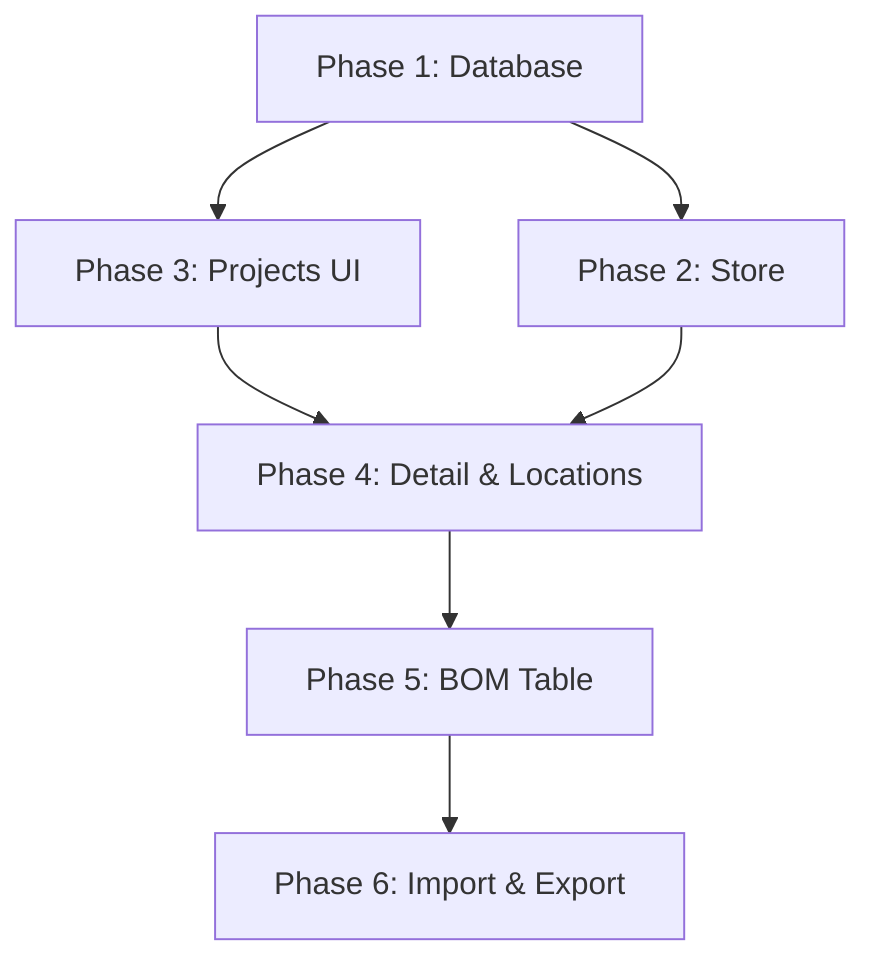

# BOM Translation Module - Phase Index

> **For Claude:** This plan has been split into 6 phases to prevent JSON serialization errors. Use superpowers:executing-plans to implement each phase sequentially.

**Goal:** Build a complete BOM Translation module that replicates the proven BOM_JS workflow in the new Tauri + React stack, enabling CSV import, inline editing, and multi-format export (XML, CSV, JSON).

**Architecture:** SQLite database with BOM projects/locations/items tables. React UI with Zustand state management. TanStack Table for editable grid. Tauri plugins for file I/O. TypeScript for business logic (CSV parsing, XML generation).

**Tech Stack:** Tauri 2.0, React 19, TypeScript, Zustand, TanStack Table, @tauri-apps/plugin-sql, @tauri-apps/plugin-dialog, @tauri-apps/plugin-fs

---

## Phase Overview

This complex feature has been split into 6 manageable phases with natural dependency boundaries:

| Phase | Name | Tasks | Est. Lines | Duration | Prerequisites |
|-------|------|-------|------------|----------|---------------|
| **1** | [Database](./2025-12-27-bom-translation-module-phase-1-database.md) | 3 tasks (schema, types, client) | ~486 | 30-40 min | None |
| **2** | [Store](./2025-12-27-bom-translation-module-phase-2-store.md) | 1 task (Zustand store) | ~412 | 30-40 min | Phase 1 complete |
| **3** | [Projects UI](./2025-12-27-bom-translation-module-phase-3-projects-ui.md) | 2 tasks (landing, manager dialog) | ~479 | 2-3 hours | None (parallel to Phase 2) |
| **4** | [Detail & Locations](./2025-12-27-bom-translation-module-phase-4-detail-locations.md) | 2 tasks (detail page, location tabs) | ~420 | 2.5 hours | Phase 3 complete |
| **5** | [BOM Table](./2025-12-27-bom-translation-module-phase-5-bom-table.md) | 3 tasks (table setup, part search, editable table) | ~457 | 3-4 hours | Phase 4 complete |
| **6** | [Import & Export](./2025-12-27-bom-translation-module-phase-6-import-export.md) | 2 tasks (CSV import, export functionality) | ~459 | 3-4 hours | Phase 5 complete |

## Dependency Graph

## Execution Strategy

**Recommended:** Execute phases sequentially (1→2→3→4→5→6)

**Alternative:** Parallel execution possible for phases 2&3 (both depend only on Phase 1)

## Why Split?

The original plan was 2,725 lines (~84KB) which exceeded the `write` tool's JSON serialization limits. Each phase is now under 500 lines, ensuring reliable execution.

## Original Plan Archive

The complete original plan is preserved at: [ORIGINAL](./2025-12-27-bom-translation-module-ORIGINAL.md.bak)

---

## Phase 1: Database Schema & Types
**[→ View Phase 1](./2025-12-27-bom-translation-module-phase-1-database.md)**

**Tasks:** Create BOM database migration, TypeScript types, and database client operations.

**Deliverables:**
- `src-tauri/migrations/002_bom_tables.sql` - SQLite schema
- `src/types/bom.ts` - TypeScript interfaces
- `src/lib/db/client.ts` - Extended with BOM operations

---

## Phase 2: Zustand Store
**[→ View Phase 2](./2025-12-27-bom-translation-module-phase-2-store.md)**

**Tasks:** Create Zustand store with BOM state management.

**Deliverables:**
- `src/stores/bom-store.ts` - Complete store with CRUD operations

**Prerequisites:** Phase 1 (database schema and client)

---

## Phase 3: Projects List UI
**[→ View Phase 3](./2025-12-27-bom-translation-module-phase-3-projects-ui.md)**

**Tasks:** Update landing page and create project manager dialog.

**Deliverables:**
- Updated `src/pages/bom.tsx` with project selector
- `src/components/bom/project-manager-dialog.tsx` with full CRUD

**Prerequisites:** None (can run parallel to Phase 2)

---

## Phase 4: Project Detail Page & Location Tabs
**[→ View Phase 4](./2025-12-27-bom-translation-module-phase-4-detail-locations.md)**

**Tasks:** Create project detail routing and location management tabs.

**Deliverables:**
- `src/pages/bom-project.tsx` - Detail page with routing
- `src/components/bom/location-tabs.tsx` - Editable location management

**Prerequisites:** Phase 3 (project selection UI)

---

## Phase 5: Editable BOM Table
**[→ View Phase 5](./2025-12-27-bom-translation-module-phase-5-bom-table.md)**

**Tasks:** Install TanStack Table, create part search dialog, build editable table.

**Deliverables:**
- `src/components/bom/part-search-dialog.tsx` - Master parts lookup
- `src/components/bom/bom-table.tsx` - Complete editable table with CRUD

**Prerequisites:** Phase 4 (location tabs for filtering)

---

## Phase 6: CSV Import & Export
**[→ View Phase 6](./2025-12-27-bom-translation-module-phase-6-import-export.md)**

**Tasks:** Implement CSV import workflow and multi-format export (XML, CSV, JSON).

**Deliverables:**
- CSV parsing and validation
- XML export generation
- JSON/CSV export formats
- File dialog integration

**Prerequisites:** Phase 5 (BOM table for data display)

---

## Success Criteria

- [ ] All 6 phases executed successfully
- [ ] BOM translation module fully functional
- [ ] CSV import working
- [ ] Multi-format export working
- [ ] Inline editing operational
- [ ] UI matches BOM_JS workflow

## Timeline Estimate

**Total hands-on time:** 12-15 hours
**Total calendar time:** 3-4 weeks (with testing and iteration)

**Phase breakdown:**
- Phase 1-2: 1-2 hours (foundation)
- Phase 3-4: 3-4 hours (UI scaffolding)
- Phase 5: 4-5 hours (core table functionality)
- Phase 6: 4-5 hours (import/export features)